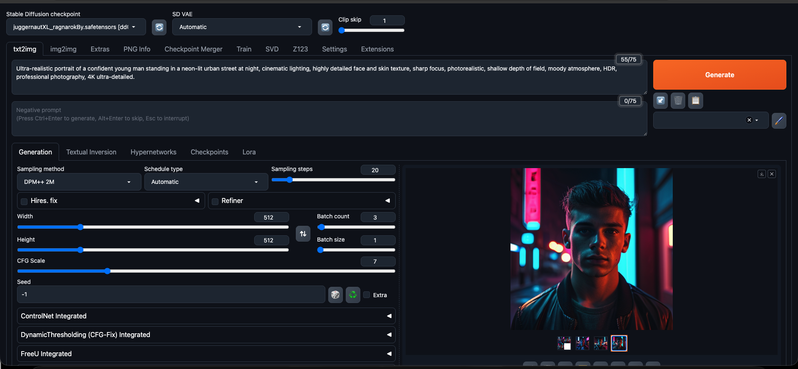
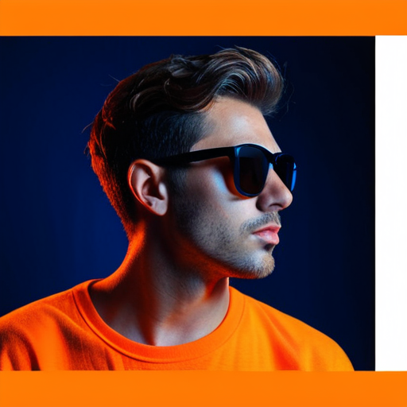
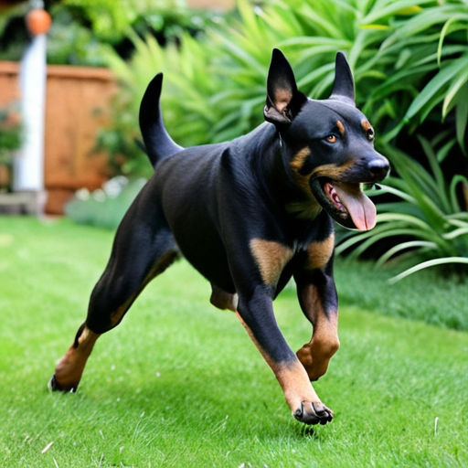
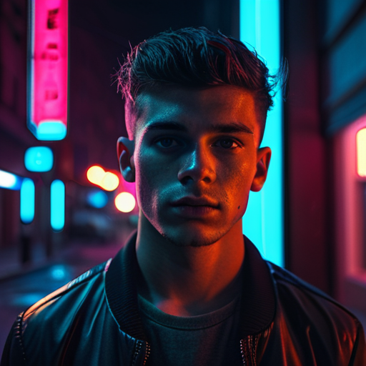
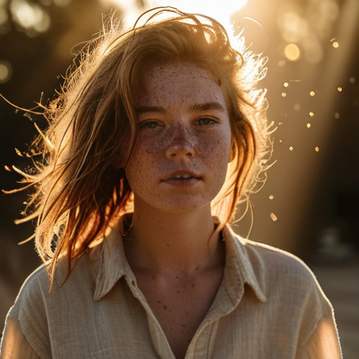

# AI Image Studio

A local, browser-based AI image generation and editing platform. Generate stunning images from text, transform existing photos, apply advanced upscaling, and run everything on your own hardware with full privacy.

---

## What This Project Does

AI Image Studio is a self-hosted generative AI workspace that runs entirely on your local machine. No cloud subscriptions, no data leaving your computer, and no usage limits.

**Core capabilities:**
- **Text-to-Image** — Type a description and the AI generates a matching image
- **Image-to-Image** — Upload a photo and transform or enhance it with AI
- **Inpainting** — Remove objects or fill in missing parts of an image
- **Upscaling** — Increase image resolution with AI-powered detail recovery
- **Batch Generation** — Create multiple images at once from prompt lists
- **Live Preview** — Watch images generate in real time

**Hardware flexibility:**
- Works on NVIDIA GPUs (CUDA), AMD GPUs (ROCm), Apple Silicon (MPS), and even CPU-only setups
- Automatic memory management adapts to 4GB VRAM laptops up to 24GB+ workstations
- No internet required after initial setup

---

## Quick Start

### Requirements

- **Python** 3.10, 3.11, or 3.12 (3.13 is not supported yet)
- **Git**
- **GPU** (optional but strongly recommended) — NVIDIA GTX 1060+ or RTX series, AMD RX 5000+, or Apple M1/M2/M3
- **RAM** — 8GB minimum, 16GB recommended
- **Storage** — 20GB free space for the app + models

---

## Installation

### Step 1 — Clone the Repository

Open Terminal in your project folder, then run:

```bash
git clone https://github.com/patelpreet332/ai-image-studio.git
cd ai-image-studio
```

### Step 2 — Create and Activate the Virtual Environment

```bash
# Create the virtual environment (one-time setup)
python3 -m venv venv

# Activate on macOS / Linux
source venv/bin/activate

# Activate on Windows
venv\Scripts\activate
```

> After activating, your terminal prompt should show `(venv)` at the beginning.

### Step 3 — Install Python Dependencies

With the virtual environment active, install all required packages:

```bash
pip install -r requirements_versions.txt
```

This downloads and installs PyTorch, Gradio, Transformers, and all other dependencies. It will take **10–30 minutes** depending on your internet speed.

> If `pip` is not found, try `python3 -m pip install -r requirements_versions.txt` instead.

### Step 4 — Download a Model

You need at least one AI model checkpoint to generate images.

**Recommended starter model:**
- `juggernautXL_ragnarokBy.safetensors`

Place the downloaded file into:

```
models/Stable-diffusion/
```

The final path should look like:

```
models/Stable-diffusion/juggernautXL_ragnarokBy.safetensors
```

> **Where to get models:** Search for `.safetensors` or `.ckpt` checkpoint files on HuggingFace or CivitAI. Files ending in `.safetensors` are preferred for security.

### Step 4 — Launch the App

**macOS (Recommended settings):**

```bash
export COMMANDLINE_ARGS="--skip-torch-cuda-test --no-half --medvram"
./webui.sh
```

**Windows:**

```bash
webui-user.bat
```

**Linux:**

```bash
./webui.sh
```

The first launch will download additional dependencies automatically. This may take 10–30 minutes depending on your internet speed.

### Step 5 — Open in Your Browser

Once the terminal shows `Startup time:` and a local URL, open:

```
http://127.0.0.1:7860
```

### Step 6 — Generate Your First Image

1. Make sure you are on the **txt2img** tab
2. Paste this prompt into the top text box:

```
ultra realistic portrait, cinematic lighting, 4k, highly detailed, sharp focus
```

3. Click **Generate**
4. Wait for the progress bar to finish — your image will appear on the right

---

## How to Use

### txt2img (Text to Image)

1. Enter a description in the **Prompt** box
2. (Optional) Enter what you want to avoid in the **Negative Prompt** box
3. Adjust **Width** and **Height** — 512×512 for standard models, 1024×1024 for XL models
4. Set **Sampling Steps** — 20 to 30 is a good default
5. Set **CFG Scale** — 7 to 9 is a good default (higher = more literal to prompt)
6. Click **Generate**

### img2img (Image to Image)

1. Switch to the **img2img** tab
2. Drag and drop an image into the input area, or click to upload
3. Enter a prompt describing how you want to transform it
4. Adjust **Denoising Strength**:
   - `0.3` — subtle changes
   - `0.5` — moderate restyle
   - `0.7` — heavy transformation
5. Click **Generate**

### Inpainting

1. Switch to the **img2img** tab, then the **Inpaint** sub-tab
2. Upload an image and paint over the area you want to change
3. Enter a prompt describing what should replace the painted area
4. Click **Generate**

### Saving and Finding Your Images

All generated images are automatically saved to:

```
outputs/txt2img-images/       # Images from txt2img
outputs/img2img-images/       # Images from img2img
outputs/extras-images/        # Upscaled or restored images
```

Click the folder icon below any generated image to open its location.

---

## Showcase












---

## Command-Line Options

You can customize startup behavior by setting `COMMANDLINE_ARGS` before launching.

**Common options:**

| Flag | What It Does |
|------|--------------|
| `--listen` | Allow other devices on your network to access the UI |
| `--share` | Create a temporary public URL (uses Gradio tunneling) |
| `--nowebui` | Run only the API server, no web interface |
| `--medvram` | Reduce VRAM usage for 4GB–6GB GPUs |
| `--lowvram` | Further reduce VRAM usage for 2GB–4GB GPUs |
| `--always-offload-from-vram` | Unload models after each generation (slower, safer) |
| `--skip-torch-cuda-test` | Skip CUDA detection (needed for macOS / CPU mode) |
| `--no-half` | Use full 32-bit precision (fixes black images on some GPUs) |
| `--xformers` | Enable xFormers attention optimization (faster generation) |
| `--opt-sdp-attention` | Use PyTorch scaled dot-product attention (alternative to xFormers) |

**Example for a 6GB laptop GPU:**

```bash
export COMMANDLINE_ARGS="--medvram --opt-sdp-attention --no-half"
./webui.sh
```

**Example for CPU-only mode:**

```bash
export COMMANDLINE_ARGS="--skip-torch-cuda-test --no-half --use-cpu all"
./webui.sh
```

---

## Project Structure

```
ai-image-studio/
├── webui.sh                   # macOS / Linux launcher
├── webui-user.bat             # Windows launcher
├── webui.py                   # Main entry point
├── launch.py                  # Dependency installer
├── requirements_versions.txt  # Python dependencies
├── models/
│   └── Stable-diffusion/      # Put your .safetensors models here
├── outputs/                   # Generated images saved here
├── extensions/                # Installable plugins
├── configs/                   # Model configuration files
├── modules/                   # Core backend code
├── javascript/                # Frontend scripts
└── html/                      # UI templates
```

---

## Troubleshooting

### "No module named 'torch'"
Run:
```bash
pip install torch torchvision torchaudio
```

### "CUDA out of memory" or black images
Add these flags:
```bash
export COMMANDLINE_ARGS="--medvram --no-half"
```

### "No checkpoints found"
Make sure your `.safetensors` file is inside `models/Stable-diffusion/` (not `models/` directly).

### macOS: "MPS backend out of memory"
Reduce image resolution or add `--always-offload-from-vram`.

### First launch is very slow
This is normal — dependencies and model components are being downloaded. Subsequent launches are much faster.

---

## Security Notes

- **Local by default:** The server only accepts connections from your own computer (`127.0.0.1`). To allow network access, add `--listen`.
- **Authentication:** Enable password protection with `--gradio-auth username:password`.
- **API security:** Protect REST endpoints with `--api-auth username:password`.
- **No cloud uploads:** All images and models stay on your machine unless you explicitly enable sharing.


